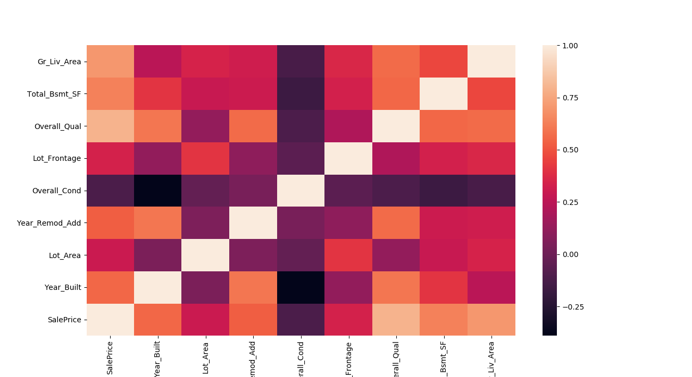

Assignment 2: Regression Modeling & Prediction
==============================================

I. Data Preparation Questions
-----------------------------

1) What specific data transforms did you perform prior to exploration and analysis, and why did you choose these?
-------------------------------------------------------------------------------------------

+ I first got rid of the PID attribute. It's numeric, but it has no bearing on the sales price. Instead, it's simply a unique identifer of key used to differentiate records. 

+ Some things irk me, and some things are simply carried over by best practice. I removed the sales price as the last column (because it irks me to not be on the far left in a tabular environment). I also replaced all the '.' characters in the column headers with underscores, since some environments get confused when parsing strings that contain '.' in them. 

+ I performed a large amount of data cleaning. Naturally that's a huge part of the overall process. In this case, it mostly involved filling in fields where the data had been encoded as 'NA' during capture. This seemed to cause an issue with either Python or sklearn, where the machine viewed those values as invalid. 

+ The dataset was also comprised of both numeric and categorical data. In order to use all the data, the categorical values were given binary identifiers. 

II. Exploratory Analysis Questions
----------------------------------

Perform an exploratory analysis on your data by visualizing and/or applying other means of data exploration.

1) What (if any) insights jump out at you?
------------------------------------------

+ I ran a heat map in Seaborn. The pairs plot was a bit messy given the amount of data present in the set. Therefore, I opted to parse down the data to variables I *thought* would have a correlation or bearing on the sales price. 

+ Initially, the overall quality, total basement square footage, and great room living area had high correlations with the sales price - at least based off of the heatmap. 

2) Do you have any hypotheses about relationship of certain variables to the price?
-----------------------------------------------------------------------------------

+ I thougtht that some of the variables would reinforce each other, ergo multicollinearity. This didn't pan out the way I thought that it would, though. I thought that possibly the size of a room, or the conditoin of a feature would feed into the overall quality, but this strangely wasn't the case. 

+ I still think there is a small case to argue the multicollinearity exist, especially after running a variance inflation factor test. Some of the factors resolve to infinity, but I'm not sure if that is due to a div/0 problem 'under the hood' or not. To stay on the same side, I left them in the set. 

