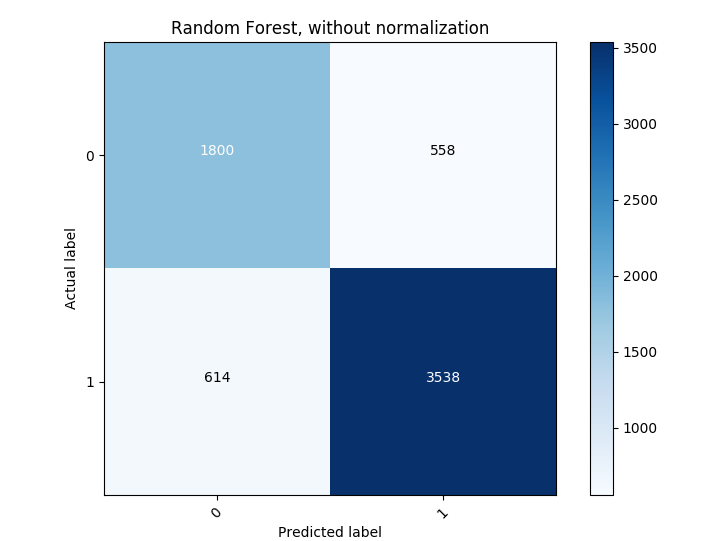

<head>
	<link rel="stylesheet" type="text/css" href="./util/mdstyle.css">
</head>

<h2><b>Assignment 4</b></h2>
<br>
Author: Greg Phillips</br>   
Date:   11.12.2017
<hr>

<h1><b>Assignment 4: Predicting Employees and Contractors</b></h1>


<hr>

<button class="accordion"></button>
<div class="panel">

<h2><b>0) The Question, the Problem</b></h2>

<hr>
<div class="standard">

+ The Occupational Safety and Health Administration (OSHA) requires organizations to track occupational injuries. This implies organizations maintain accurate recordkeeping of their employees and the types of incidents they are involved in. This allows OSHA to accurately gauge the overall safety of the workplace enviornment and protect workers from occupational injury.

+ Organizations are required to report incidents related to their employees; however, the work environment of today is not always comprised of one company acting alone. Instead, it's common to employ contractors to perform work along side an organization.

+ Most organizations, such as AECOM, track workplace injuries of thier contractors as well. Naturally, providing a safe work environment for our working partners is beneficial to all invested in a business venture. Both AECOM Employee and Contractor incidents are logged in the same database, IndustrySafe, to be centrally managed and stored.

+ This, however, presents a problem. IndustrySafe, AECOM's online safety reporting software suite, is used to formulate incident rates for legal, business, and performance purposes. Properly distinguishing between an actual AECOM Employee and Contractor is paramount; <b>Contractors</b> aren't included in these rates. If they are included, they have the propensity to negatively influence the overall metrics.

+ <b><i>The problem, therein, lies at data entry</i></b>. It's not often clear to an end user whether or not someone is an AECOM Employee 'proper', or one of our contractors. I've often wondered if most end users simply default to classifying someone as an AECOM Employee when they don't know. While this isn't as bad as classifying an actual employee as a contractor, it's still detrimental to metrics, such as OSHA's Recordable Incident Rate.

+ The question then is, "Can we develop a model that accurately predicts if a record is an AECOM Employee or Contractor, based off of other information we know about the record." Since there are thousands of records created every year, a model could quickly and efficiently quality check data as it came in, where such a task would require a staff to accomplish.

</div>
<hr>

</div>

<button class="accordion"></button>
<div class="panel">

<h2><b>1) The Data</b></h2>

<hr>
<div class="standard">

+ The data is comprised of Safety, Health, and Environmental records generated from AECOM's IndustrySafe online incident reporting system. Each time an employee experiences an incident (such as those associated with physical harm, property damage, or hazardous material spills), they - or someone on their behalf - enter the incident into the IndustrySafe database.

+ In keeping with the Health Insurance Portability and Accountability Act of 1996 (HIPAA); best practices associated with the protection and dissemination of employee personally identifiable information (PII); and AECOM's own internal guidelines that govern the dissemination of said information, all fields which could possibily indicate a specific employee have been removed from the data set prior to importing it into the working environment.

	+ Removal of these attributes has no bearing on the outcome of the analysis. Attributes such as employee names and employee tracking IDs would not factor into the overall outcome.

+ The dataset contains the following attributes:

	+ Business Group
		+ Sub entity within AECOM as a whole
	+ Incident Type
		+ Classification of the incident record itself
	+ Potential Severity
		+ How bad of an outcome this could / did have
	+ Potential Probability
		+ Frequency we expect this type of incident to occur
	+ Business Line
		+ Fuctional line of business (transportation, civil infrastructure, oil & gas, etc.)
	+ Worker Type
		+ AECOM Employee or Contractor
	+ Date of Incident
		+ Calendar Day / Month / Year the incident occured

+ Overall, this data set is composed of 6510 records from fiscal year 2017. 

</div>
<hr>

</div>

<h2><b>2) Cleaning up the Data (Outside the Work Environment)</b></h2>

<hr>

+ The data required a bit of massaging and manipulation before analysis. The following transformations were made to the data outside of the work environment:

+ The data set contained the column 'Date of Incident', which was renamed to 'Month'

	+ Each record contained the specific calendar day which the incident occurred. 
	+ These fields were mapped to the corresponding month of the year, as a text label.
		+ i.e., 03/04/2017 became 'March'. 

+ Contractors can come in more than one type. That distinction is not necessary for this analysis. 

```python
'''
- Changed 'Worker Type' WHERE value == 'Contractor/Subcontractor (Managed)'
- Replaced 1040 locations with 'Contractor'

- Changed 'Worker Type' WHERE value == 'Contractor/Subcontractor (Unmanaged)'
- Replaced 1316 locations with 'Contractor'
'''
```

+ Some records do not need to be included, and were removed. The data set contains more than 'AECOM Employees' and 'Contractors'. It also contains joint venture partners, as well as members of the public. 

```python
'''
- Removed records WHERE value of 'Worker Type' == 'JV Partner'. 
- Removed a total of 6 records. 

- Removed records WHERE value of 'Worker Type' == 'Third Party/Public'. 
- Removed a total of 38 records. 
'''
```

<hr>

<h2><b>3) Importation and First Look</b></h2>

<hr>

+ It seems the business world runs on MS Excel. As such, vendors and third party software suppliers normally add in the ability to get data out of an application in a .xlsx format. It's convenient for normal end users, but it isn't very conducive to analysis.

+ You can use Excel's built-in save function to save the file as a .csv extension; however, this doesn't always work. Depending on the exported format from the database it's housed in (JSON, XML, HTML), the data might come out a bit messy. 

+ Fortunately, pandas and Python have a built in module for importing directly from a spreadsheet.

+ From a terminal, use the command (substitute pip for the package manager you use): 

```unix
sudo pip install xlrd
```

+ Then within your Python code:

```python
data = pd.read_excel('./data/incs.xlsx', sheet_name='fy17');
```

+ This comes in especially useful if your spreadsheet isn't hosted on you local machine. You can specify a host within the string to point pandas to a remotely hosted spreadsheet. YMMV.

+ The ```read_excel``` method takes a string argument for the worksheet you want to import. There are other paramaters you can specify as well. Since my spreadsheet contained multiple tabs within it, I used the ```sheet_name='fy17'``` argument as well.

	+ Due to the size of the data, I was forced to download each month separately. The 'fy17' tab is where I aggregated each month by hand. Ergo, that's where I want pandas to look for the entirety of my incident records. 

+ Here, you can see column names within the data set. I cleverly placed 'Worker Type' at index 0, as it will function as the dependent /response variable for this analysis. 

```python
'''
Column names: 
[u'Worker Type', u'Incident Type', u'Month', u'Potential Severity', u'Potential Probability', 
u'Business Group', u'Business line']

'''
```

+ Here, a simple ```.head()``` and ```.tail()``` allow us to verify we've got the correct data in the data set. 

```python

print("\nSample data: "); 
print(data.head(5)); 

'''
Sample data: 
      Worker Type
0  AECOM Employee 
1  AECOM Employee 
2  AECOM Employee
3  AECOM Employee
4  AECOM Employee

'''
print(data.tail(5));

'''
     Worker Type
6505  Contractor
6506  Contractor
6507  Contractor
6508  Contractor
6509  Contractor  

'''
```

<hr>

<h2><b>4) Transformation and Cleaning up Data</b></h2>

<hr>

+ Now that we've verified we're able to actually read in from our spreadsheet (honestly, how cool is that?), we can move on to transforming the data into something Python can actually work with. In the real world, most data is dirty. In other words, it really requires a good bit of 'cleaning' up in the general sense before we can apply it to a model. Some stuff is apparent, while some stuff doesn't jump out at you. 

+ First, I isolated the response variable and encoded it using numpy. At this point, we have two values in the data set:

	+ 'AECOM Employee'
	+ 'Contractor'

+ Every time the code 'sees' the text 'AECOM Employee', I want it encoded with a 1 [true]. Otherwise, I want it to be encoded with a 0 [false]. 

+ First, pull out the response variable from the data frame (in this case, 'Worker Type'):

```python
target_result = data['Worker Type']; 

```

+ Then, using numpy, apply a simple if / then statement (via the ```numpy.where``` method) for the transformation:

```python
y = np.where(target_result == 'AECOM Employee', 1, 0)

```

+ This yields a response variable ('Worker Type'), that is either 'true' [1] for an AECOM Employee, or is 'false' [0] for a Contractor. 

+ Remove the column ```Worker Type``` from the feature space. 

```python
data = data.drop(['Worker Type'], axis=1); 
```

+ Next, we need to get rid of the text values. This part might not be apparent at first, but its crucial to performing the analysis. Ergo, we need a label encoder, or something that can take a column, find all the different text values / categories in it, then encode it properly. 

+ To accomplish this, we'll use pandas ```get_dummies()``` method, coupled with a utility label encoder borrowed from <a href=https://github.com/chrisgarcia001>Chris Garcia, PhD</a>. The ```get_dummies()``` method converts categorical values into "dummy", or indicator variables, while the ```cat_features()``` function returns a list of the categorical features for a given dataframe. They work hand in hand to get rid of the text and leave us with a nice, clean, numerical data frame. 

```python
data = pd.get_dummies(data, columns=util.cat_features(data));

```

+ For good measure, I pull out the feature space for future use. I might not use them, but it's good to save it just in case I need to reference what they are later on. 

```python
features = feature_space.columns;  

```

+ Then transform the feature space into a sort of 'matrix of floats'. 
	
	+ Note: this probably isn't necessary for this data set, but it's something I'm accumstomed to doing. I don't believe it has a negative impact if I do it regardless, but I'm not sure if it will have a positive influence either. Since I sort of want this to be a 'plug and play' set of code, I'm leaving it in.

```python
X = feature_space.as_matrix().astype(np.float); 

```

+ What is important for some models:

	+ A lot of predictors care about the size of the features themselves, even if the actual scaling of those features is meaningless in their relationship. For instance, if I had a data set that included the number of incidents submitted by a particular person and also included the number of "really really bad" incidents they submitted (i.e., something terrible happened to them), the former would outweigh the latter by a few orders of magnitude (at least we really hope so in our line of work). However, that doesn't mean that the latter is any less significant. 

	+ To account for this, we normalize the data for each member of a feature from a range between 1.0 and -1.0. This keeps models from applying too much weight where they shouldn't. Conveniently ```sklearn.preprocessing``` includes a ```StandardScaler``` which accomplishes this for us. 

+ Apply the scaler to the X data, or the predictors:

```python
scaler = StandardScaler(); 
X = scaler.fit_transform(X);

```

+ At this point, we have a feature space (which I've denoted as X), and a target value (which I have denoted as y). This is our model, and it's ready to be applied to a multitude of algorithms for predictions. 

+ However, it's good measure at this point to check and make sure we've not done anything crazy with the data. We done a lot of moving and transforming, so it's good to check and make sure that we didn't forget anything. 

+ Let's check to see if there's missing data. The ```check_missing_data``` is a utility function I built to look for missing values within a data frame. It looks for ```null``` values across the set, and prints out the column names that contain them (if it finds them). 

+ Here, we are simply printing back to the screen the name of the frame, and whether or not there was missing data. 

```python
b = util.check_missing_data(data); 
if(b):
	print('Found Missing Data'); 
	show_name(data); 
	print('\n');
else:
	print('No Missing Data!');
	show_name(data); 
	print('\n');

'''
No Missing Data!
DataFrame Name is: data
'''

```

+ The ```check_missing_data``` didn't find anything missing throughout the data set, which is a good thing. I find this utility to be really helpful, especially when the data set is large and non-conducive to 'looking it over' with your eyes. 

+ One final sanity check, before moving onto predictions. 

```python
print("Feature space contains %d records and %d columns" % X.shape); 
print("Number of Response Types:", np.unique(y)); 

```

+ Which yields:

```python
'''
Feature space contains 6510 records and 64 columns
('Number of Response Types:', array([0, 1]))
'''

```

+ Here we have two important pieces of information:

	+ Our feature space contains the correct amount of records, and after we label encoded all the text, it has the correct amount of columns as well. 

		+ Incident Type x 9
		+ Month x 12
		+ Potential Severity x 5
		+ Potential Probability x 5
		+ Business Group x 8
		+ Business Line x 25

	+ And our response variable, has the correct types we encoded earlier (either a 1 or a 0)

+ Now that we've cleaned up the data, transformed it, and given a few sanity checks, we can rest easy knowing that our data is ready to be processed. Now we can move onto making the predictions. 

	> It's extremely good practice to perform these sanity checks along the way. Every time you move data; slice it up; or transform it; it's good to make sure that the machine is producing the results you expect. 

<hr>

<h2><b>5) Evaluate different modeling approaches</b></h2>

<hr>

+ Now that our data is ready, I'll start looking through different modeling appraoches to see what works the best. First, I'll start off by simply running the data through different algorithms, and comparing how the algorithm performs. To measure this, I'll base it off the <b>accuracy</b> error metric, or the proportion of the total number of predictions that were correct.

```python
print("Support Vector Machine:"); 
print("%.4f" % util.accuracy(y, util.run_cv(X,y,SVC))); 
print("Random Forest:"); 
print("%.4f" % util.accuracy(y, util.run_cv(X,y,RF))); 
print("K-Nearest-Neighbors:"); 
print("%.4f" % util.accuracy(y, util.run_cv(X,y,KNN))); 
print("Naive Bayes Bernoulli:"); 
print("%.4f" % util.accuracy(y, util.run_cv(X,y,BNB)));
print("Naive Bayes Gaussian:"); 
print("%.4f" % util.accuracy(y, util.run_cv(X,y,GNB)));
print("Decision Tree (Gini Impurity):"); 
print("%.4f" % util.accuracy(y, util.run_cv(X,y,DTC)));  

```

+ There's alot going on underneath the hood here. The ```accuracy()``` method simply returns the accuracy score. Nested within it, is the ```run_cv()``` method which takes in our feature space, our response variable, and the type of model we want to run. 

+ The ```run_cv()``` method creates a KFold object, folds the data 5 times, and shuffles the records around.

```python
kf = KFold(len(y), n_folds=5, shuffle=True);

```

+ Then it splits the data up into test and train sets, creates a model object with any associated key word arguments (if you so choose to pass them), and fits the data to the model. 

```python
for train_index, test_index in kf:
	X_train, X_test = X[train_index], X[test_index]; 
	y_train = y[train_index]; 
	clf = clf_class(**kwargs); 
	clf.fit(X_train, y_train); 
	y_pred[test_index] = clf.predict(X_test); 

```

+ I took this function directly from <a href=http://scikit-learn.org/stable/modules/generated/sklearn.model_selection.KFold.html>scikit-learn.org</a> in case you're interested in the specifics of it. It's a rather common implementation of KFold's use. You can find it plastered all of the internet without looking too hard.  

+ The object of this is to ensure that:

	+ We split the data multiple ways, so we don't simply create predictions off a singular 'point of view' on the data itself. We want to 'view it from different angles'. 

	+ Shuffle the data up. Here, we want to avoid one 'fold' of the data ending up with nothing but AECOM Employees or just Contractors. In essence, we want to shuffle the deck. 

+ ```run_cv()``` returns the predictions ```return y_pred```, which are piped back up to the ```accuracy()``` method, giving us an overall percentage of what each algorithm 'gets right'. 

+ Performance of each algorithm:

```python
'''
Support Vector Machine:
0.8452
Random Forest:
0.8226
K-Nearest-Neighbors:
0.7965
Naive Bayes Bernoulli:
0.7591
Naive Bayes Gaussian:
0.4249
Decision Tree (Gini Impurity):
0.8020
'''
```

+ Each algorithm performs rather well, with the exception of the Gaussian Naive Bayes algorithm - which shouldn't come as too much of a shock. This, however, is just using <b>accuracy</b> as the error metric - but we can't always rely on a measurement to explain whether or not a model is good or bad. Models don't always spit out high performance measures when they're good, and they won't always spit out low numbers when they are bad. It's simply not that black and white. If it were, models would simply be akin to algebraic formulas; you'd plug your data in, let the model cogitate, then wait for it to spit you out a number (fingers crossed that it's a high number). 

+ Instead, error metrics give you a good indication that you've built a model that's solid, and can be put to use. It's still the job of the scientist to verify that the model is actually valid. 

	+ For instance, in our case it's bad enough if the classifier predicts that a record is an AECOM Employee and they're actually not. Our rates will take a hit (as we're including records we don't need to), but we're not missing anything that we should be including. 

	+ But it's worse if my classifier predicts that a record is a Contractor when they are, in fact, an AECOM Employee. Here, we'd be missing out on data, and undereporting. That has the potential to get us in trouble with the government.

+ Plus we can't forget the old adage <i>garbage in, garbage out</i>. Our model is only ever going to perform as well as the data it's fed. 

	> Support Vector Machine looks to be our winner , but let's make sure. In the Safety realm, there's no room for error. 

<hr>

<h2><b>6) Data Visualization</b></h2>

<hr>

+ It's nearly <i>always</i> more palatable to general audiences to visualize the data with pictures and graphs. Command lines and scripts are good for displaying information, but they're only good for a particular audience. Generally, most people don't want to look at a terminal window.

+ Here, we'll use ```matplot.pyplot``` to pretty up our confusion matrices. I'll be using another boiler plate function from <a href=http://scikit-learn.org/stable/auto_examples/model_selection/plot_confusion_matrix.html>scikit-learn.org</a> that I've added to my data_util file.

	> At this point, remember that 1 is an "AECOM Employee", and 0 isn't - or is a "Contractor".





> Again, it's good to go back and really think about the question we're asking. This helps us to determine what error metrics we should really be focused on. 

+ Here, a good question to ask is: 

	> When a record is attributed to an AECOM Employee, how often does my classifier correctly predict that?. 

+ This is the <b>recall</b> error metric, or <i>the fraction of relevant instances that have been retrieved over the total amount of relevant instances</i>. In other words, are we saying the record is associated with an AECOM Employee when it actually is?  

Algorithm | Total Relevant Instances | Relevant Instances | Recall Score
--- | ---: | ---: | ---:
K-Nearest-Neighbors | 4152 | 3619| 0.8716
Random Forest | 4142 | 3538 | 0.8528
Support Vector Machine | 4152 | 3631 | 0.8714
Naive Bayes Bernoulli | 4152 | 3116 | 0.7529
Naive Bayes Gaussian | 4152 | 431 | 0.1053
Decision Tree (Gini Impurity) | 4152 | 3423 | 0.8194

+ Here, K-Nearest-Neighbors edges out Support Vector Machines. It's able to perform slightly better <i>when it's asked to predict if the record is an AECOM Employee when they actually are</i>.

+ An equally important question to ask is:

	> When my classifier predicts a record is associated with an AECOM Employee, how often is this true?

+ This is the <b>precision</b> metric, or <i> the fraction of relevant retrieved instances, among the retrieved instances</i>. 

Algorithm | Retrieved Instances | Relevant Instances | Precision Score
--- | ---: | ---: | ---:
K-Nearest-Neighbors | 4170 | 3898 | 0.8159
Random Forest | 4152 | 4152 | 0.8641
Support Vector Machine | 4170 | 4150 |0.8803
Naive Bayes Bernoulli | | | 0.8562
Naive Bayes Gaussian | | | 0.9467
Decision Tree (Gini Impurity) | | | 0.8643

+ Insert winner here. 

+ To sum up our analysis to this point:

Algorithm | Accuracy (Rank) | Recall (Rank) | Precision (Rank)
--- | :---: | :---: | :---:
Random Forest | second | third  | 
Support Vector Machine | first  | second  |
K-Nearest-Neighbors | fourth  | first  | 
Naive Bayes Bernoulli | fifth | fifth|
Naive Bayes Gaussian | sixth | sixth |
Decision Tree (Gini Impurity) | third | fourth |

<hr>

<h2><b>7) Beyond Classification</b></h2>

<hr>

+ Classification is great, but it's actually lacking a lot of information - <i>which most people really want</i>. Think of it like this:

	> You probably won't be in a car crash on your way home today. 

	or

	> There's a 65% chance you'll be in a car crash on your way home today. 

+ Which piece of information would you rather have, if you needed to make a decision? Expand that into the business world, and you have a better understanding as to the crux of the problem. Not everything is black and white, and classification really lends itself better to the discrete realm, than that of the continuous realm. It's the distinction between integers and doubles; digital and analog; fried eggs and scrambled eggs. 

+ Probabilities makes more sense, especially when you need to communicate information <i>as it pertains to a decision making problem</i>. 

+ Here, we'll move on to the part I think is really cool because you can communicate it much easier. I'll be using the same ```run_cv()``` method I defined earlier, but I'll rewrite the code to spit out probabilities instead of classes. <a href="http://scikit-learn.org/stable/modules/generated/
sklearn.svm.SVC.html#sklearn.svm.SVC.predict_proba">Support Vector Machines</a>, <a href="http://scikit-learn.org/stable/modules/generated/sklearn.ensemble.RandomForestClassifier.html#sklearn.ensemble.RandomForestClassifier.predict_proba">Random Forests</a>, and <a href="http://scikit-learn.org/stable/modules/generated/sklearn.neighbors.KNeighborsClassifier.html#sklearn.neighbors.KNeighborsClassifier.predict_proba">K-Nearest-Neighbor</a> objects all have a built in ```predict_proba()``` method, so rewriting the code was clean, quick, and easy.

+ The ```run_cv_prob()``` function produces the following, when applied against the Random Forest algorithm:

```python
'''
   Predicted Probability  Count  Actual Probability
0                    1.0   4009                 1.0
1                    0.0   2218                 0.0
2                    0.9    132                 1.0
3                    0.1    116                 0.0
4                    0.2     16                 0.0
5                    0.8     11                 1.0
6                    0.3      7                 0.0
7                    0.4      1                 0.0
'''

``` 

+ The following table is a cleaner, more communicatable version of the above output snippet: 

Predicted Probabilty % | Number of Records  | AECOM Employee?
---: | :---: | :---:
100 | 4009 | Yes
90 | 132 | Yes
80 | 11 | Yes
40 | 1 | No
30 | 7 | No
20 | 16 | No
10 | 116 | No
0 | 2218 | No

+ Essentially the table says, there is an ```X Predicted Probability %``` that these ```Number of Records``` were an AECOM Employee. Then it shows if they were actually an ```AECOM Employee?```. Underneath the hood, were asking the model to predict the probability that 'this' record is an AECOM Employee. 

	>On the first line, the model is saying, "For these 4009 records, there is a 100% probability that they are an AECOM Employee." And, based on the last column, those records actually were associated with AECOM Employees. 

	> On the fourth line, the model is saying, "For this lonely 1 record, there is a 40% probability that it is an AECOM Employee". That record actually isn't, but the good thing is that the model didn't assign it a high percentage, nor does the model predict anything crazy - such as high percentages when they're actually the opposite. 

+ The key thing to take away from this is that the model really understands what an "AECOM Employee" record looks like, and it also knows what one doesn't look like. There are really only 8 records where it got a bit 'iffy', but even there it didn't lend them alot of weight. 


